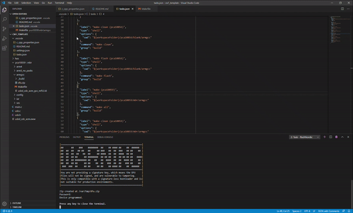
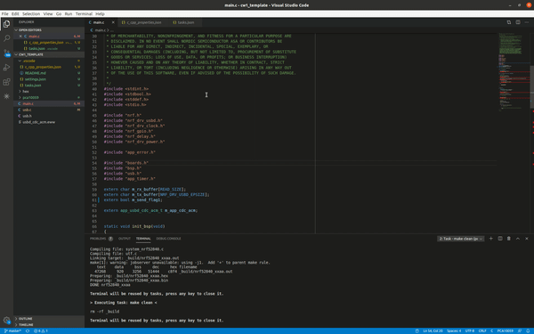
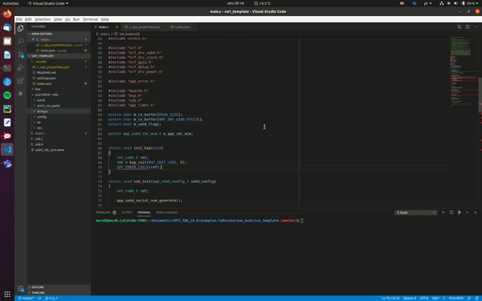

# Instalacja wymaganych narzędzi

## Windows

### Kompilator arm-gcc

Rekomendowanym kompilatorem jest gcc-arm-none-eabi, version 7-2018-q2-update, dostępny pod tym [linkiem](https://developer.arm.com/tools-and-software/open-source-software/developer-tools/gnu-toolchain/gnu-rm/downloads/7-2018-q2-update). Domyślnie kompilator zainstaluje się pod ścieżką:

```
C:\Program Files (x86)\GNU Tools Arm Embedded\7 2018-q2-update\bin
```

Sprawdź czy ten folder dodany jest ścieżki wyszukiwania otwierając wiersz polecenia i wpisując komendę: 

```
arm-none-eabi-gcc  -v
```

Jeśli nie, zamknij okno, dodaj powyższą ścieżkę do zmiennej środowiskowej PATH (np. w [ten](https://docs.alfresco.com/4.2/tasks/fot-addpath.html) sposób) i spróbuj ponownie.

### make

Potrzebny również będzie 'make' dla Windowsa do pobrania [stąd](http://gnuwin32.sourceforge.net/downlinks/make.php), opis [tutaj](http://gnuwin32.sourceforge.net/packages/make.htm). Prawdopodobnie również potrzebne będzie dodanie poniższej ścieżki do zmiennej PATH:

```
C:\Program Files (x86)\GnuWin32\bin
```

Poprawność instalacji sprawdzić można poleceniem:

```
make -v
```

### nRF5 SDK

nRF5 SDK 16.0 do pobrania pod [tym adresem](https://www.nordicsemi.com/-/media/Software-and-other-downloads/SDKs/nRF5/Binaries/nRF5SDK160098a08e2.zip). Wypakuj SDK w dowolnym miejscu.

### Visual Studio Code

Pobierz i zainstaluj VS Code: https://code.visualstudio.com/Download.


## Linux

Instalacja potrzebnych narzędzi w Ubuntu:

### arm-gcc

```
sudo apt update
sudo apt install gcc-arm-none-eabi binutils-arm-none-eabi gdb-arm-none-eabi openocd
```

### nRF5 SDK

```
cd ~/Downloads/
wget https://www.nordicsemi.com/-/media/Software-and-other-downloads/SDKs/nRF5/Binaries/nRF5SDK160098a08e2.zip
unzip nRF5SDK160098a08e2.zip -d ~/nrf5_sdk/
```

### Visual Studio Code

64bit package for Ubuntu do pobrania [tutaj](https://go.microsoft.com/fwlink/?LinkID=760868). Instalacja poleceniem poniżej. Więcej opcji [tutaj](https://code.visualstudio.com/docs/setup/linux).

```
sudo apt install ./code_1.45.1-1589445302_amd64.deb 
```


## Kompilacja i pierwsze uruchomienie

Sklonuj repozytorium z szablonami ćwiczeń na laborkę do folderu `examples` w SDK:

```
git clone https://git.pg.edu.pl/p828385/laboratorium_swim/
```

##### Ustawienie odpowiednich ścieżek w c_cpp_properties.json

Otwórz Visual Studio Code. Następnie wybierz File -> Open Folder i z pobranego właśnie repozytorium wybierz folder cw1_template. Otwórz plik `c_cpp_properties.json`. Należy teraz ustawić odpowiednią ścieżkę `"armCompilerPath"`.

- Windows

  ```
  "armCompilerPath": "C:\Program Files (x86)\GNU Tools Arm Embedded\7 2018-q2-update\bin"
  ```

- Linux

  ```
  "armCompilerPath": "/usr/bin/arm-none-eabi-gcc"
  ```

  

Uwaga: jeśli sklonowałeś repozytorium do innego folderu niż `examples`, zmień ścieżkę `"nrf52SDKPath"` na ścieżkę, pod którą znajduje się folder SDK na twoim komputerze. 

##### Kompilacja i uruchomienie
Przed rozpoczęciem wgrywania kodu na moduł ustaw zmienną "group" w settings.json na numer odpowiedni dla swojej grupy (od 01 do 10).

**Uwaga Windows**: konieczne jest używanie tasków z dopiskiem "windows: " oraz ustawienie domyślnego shella na cmd, tak jak na gifie poniżej:



Aby skompilować kod z menu wybierz Terminal -> Run Task, a następnie wybierz `make (pca10059)` i `Continue without scanning the task output`. 




Aby wgrać skompilowany program na moduł wybierz task `flashNordic`. Wpisz hasło (root). Zaczekaj, aż w konsoli pojawi się komunikat `Device programmmed.` (trwa to 20 - 30 s).



