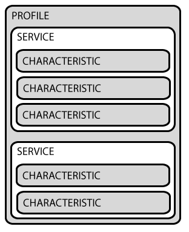

# Wstęp 

 
Mikrokontroler jest urządzeniem programowalnym pod postacią układu scalonego. Układem scalonym nazywamy komponent elektroniczny scalający wiele elementów  w jednej obudowie. Mikrokontroler zawiera w sobie: 

- mikroprocesor 

- RAM 

- ROM (Flash lub EEPROM) 

- Peryferia 

Mikrokontrolery różnią się od typowego komputera PC: 

- ilością zasobów (RAM I ROM) 

- Architekturą procesora - PC uniwersalnie używają architektur x86 i x86-64, natomiast mikrokontrolery mogą mieć różne architektury procesorów. Często używane są procesory o architekturze ARM. 

- Mikrokontrolery wykorzystywane są do niskopoziomowych  (blisko sprzętu i elektroniki) zadań, w porównaniu z PC gdzie operujemy daleko od sprzętu, na wysokim poziomie abstrakcji. 

Mikrokontrolery są przystosowane do “bycia mózgiem” i sterowania urządzeń nie wymagających dużych mocy obliczeniowych (np. pralek). Urządzenia wykorzystujące mikrokontrolery są nazywane systemami wbudowanymi. 

 
Podczas laboratorium nauczymy się programowania mikrokontrolera firmy Nordic Smiconductor, a mianowicie NRF52840. Cechą szczególną tego mikrokontrolera jest dodatkowy rdzeń będący sterownikiem BLE (Bluetooth Low Energy) 
 
Mikrokontrolery są sprzedawane razem z devkitem, czyli pomocniczą płytką elektroniczną stanowiącą interfejs do programowania. 

 
Używany przez nas devkit to płytka PCA10059, która jest w formie Dongle USB, jak widać na rys. 1.  Mikrokontroler nrf52 to ten czarny kwadratowy układ scalony pośrodku płytki. Płytka zawiera też kilka peryferów takich jak przycisk reset, diody LED, czy antenę BLE, które będą naszym interfejsem z mikrokontrolerem. 
 
By zaprogramować płytkę będzie nam potrzebny również interfejs z naszym PC. W wypadku PCA10059 mamy do dyspozycji złącze USB. Oprócz programowania posłuży ono nam do komunikacji poprzez porty szeregowe, dzięki czemu będizemy mogli widzieć komunikaty w naszej konsoli na PC. 
Kod kompilować będziemy również na PC. Zabieg programowania z jednej architektury na drugą nazywamy kompilacją na krzyż (cross-compilation). Pomimo niskopoziomowej natury, mikrokontrolery będziemy programować używając wysokopoziomowego języka C. 

  

  Rys. 1: nrf52 PCA10059 USB Dongle

Żródła:
img https://www.nordicsemi.com/Software-and-tools/Development-Kits/nRF52840-Dongle

# LAB1  

 

## GPIO 

Każdy element elektroniczny posiada określoną ilość wyprowadzeń (pinów), czyli miejsc do których możemy się podłączyć przewodami lub ścieżkami nadrukowanymi na płytce. Rys 3 przedstawia notę katalogową naszego mikrokontrolera, na której widać wszystkie jego piny. 

 

  

 *Rys. 2: Połączenie diod na płytce*

 

W układach cyfrowych przyjmujemy zazwyczaj dwa poziomy sygnałów które będą płynąć w naszym ukłądzie - 0 oraz 1; Tym wartościom przypisujemy określone poziomy napięć. Tu jedynka będzie miała wartość 3.3V, a zero będzie małym napięciem bliskim 0V. Te same jedynki i zera są zapisywane w rejestrach jako znane nam liczby w systemie binarnym. 

Najprostszym peryferium mikrokontrolera są piny GPIO (General Purpose Input Output). GPIO może być w jednym z dwóch trybów: trybie wejścia (input)), trybie wyjścia(output). 

W trybie wyjścia GPIO może podać na swój pin wartość 1 lub 0. W trybie wejścia moze odczytać te wartości i podać je nam na poziomie aplikacji. GPIO jest więc naszym elektronicznym interfejsem. 

W mikrokontrolerze nrf52 mamy do dyspozycji dwa sterowniki GPIO po ok. 32 piny każdy.  

 

  

  *Rys. 3: Mikrokontroler i opisanymi pinami*

 

Na rys 3 są one opisane jako Px.yy , gdzie x to numer sterownika, a yy to numer pinu. 
 

## LED  

Podstawowym interfejsem w przypadku mikrokontrolerów są zazwyczaj LEDy. Więc nasze “Hello World” będzie polegać na zapaleniu diody.  
 
Dioda to element elektroniczny który cechuje sie tym, że przewodzi prąd tylko w jedną stronę. Rys. 2 i 3 zostąły wzięte z dokumentacji naszego devkitu (dostępne [tutaj](https://www.nordicsemi.com/Software-and-tools/Development-Kits/nRF52840-Dongle/Download#infotabs) ). Na Rys 2. Zaznaczone są połączenia diod LED na płytce. Symbol VDD lub czasem VCC oznacza zasilanie, natomiast symbol GND lub symbol masy (rys.4), oznacza masę. Zasilanie to w naszym przypadku węzeł mający potencjał 3.3V, a masą węzeł o potencjale 0V. 

 

  

  *Rys. 4: Symbol masy*

Gdybyśmy mieli baterię, potencjał 3.3V byłby “plusem” baterii a potencjał 0V, “minusem”. By mógł popłynąć prąd, musi istnieć różnica potencjałów. Tak więc, przez element znajdujący się między plusem i minusem baterii popłynie prąd, gdyż różnica potencjałów na obu końcach tego elementu wynosi 3.3V-0V=3.3V. 

Diody w naszym układzie są jednak podpięte do GPIO mikrokontrolera. Dioda LD1 jest podpięta do węzła LED1 (Rys. 2) który jest podpięty do GPIO P0.06. Tak więc ten pin GPIO steruje diodą LD1. Ustawiając stan GPIO na 1, dioda (z rezystorem do zmniejszenia prądu) jest między potencjałami 3.3V i 3.3V, więc prąd nie popłynie. Ustawiając GPIO na 0, dioda będzie między potencjałami 3.3V i 0V, więc prąd popłynie a dioda się zaświeci. 

 

 
 

 

 
 
 
 

Biblioteki dla naszego mikrokontrolera tworzą dla nas wysokopoziomowe API, dzięki czemu nie musimy mieć wiedzy o elektronice by zapalić diodę. Funkcje którymi możemy zmieniać stan diody  to np: bsp_board_led_on oraz bsp_board_led_off czy nawet bsp_board_led_invert. Funkjce te ustawią odpowiednie piny mikrokontrolera na odpowiedni stan. 

Przykładowo, funkcja włączająca LED,  bsp_board_led_on, ma następującą implementację. Funkcja nrf_gpio_pin_write ustawia dany pin na wartość drugiego argumentu. Zgodnie z naszą wcześniejszą dedukcją, LEDS_ACTIVE_STATE jest zdefiniowane na 0, bo pin GPIO musi mieć wartość zero by dioda sie zaświeciła. 

 

 

 

## Timer 

 
Timer jest podukładem odpowiedzialnym za mierzenie czasu.  

W najprostszej postaci składa się z licznika, czyli rejestru inkrementującego swoją wartość z każdym impulsem zegara układu.  
 
Setup timera zazwyczaj polega na ustawianiu alarmów. Gdy licznik dojdzie do odpowiedniej liczby ustawionej przez alarm, zostaje wywołane przerwanie. 
 
Nasz mikrokontroler działa jednowątkowo. Tymczasową “równoległość” możemy osiągnąć porpzez przerywania wykonywania kodu przerwaniami. Synchronizację niektórych poleceń możemy np zaimplementować używając przerwań timera. 
 

Źródła:
img: https://www.vhv.rs/download/bwTwho_ground-electrical-hd-png-download/ 

## Zadania 

​	W mikrokontrolerach timery służą do cyklicznego wykonywania różnych operacji, np. pobrania danych z czujników czy przesłania jakiejś informacji. W tym ćwiczeniu zadaniem będzie wykorzystanie timera, aby zmieniać stan na diodzie. 

​	W projekcie `lab1` dioda została już skonfigurowana i powinna zapalić się po wgraniu programu na moduł. Korzystając z dokumentacji (https://infocenter.nordicsemi.com/topic/sdk_nrf5_v16.0.0/lib_timer.html oraz https://infocenter.nordicsemi.com/topic/sdk_nrf5_v16.0.0/group__app__timer.html) zmodyfikuj oprogramowanie w taki sposób, aby stan na diodzie zmieniał się cyklicznie (np. co 100 ms, podpowiedź: należy zdefiniować timer, stworzyć go, uruchomić i w odpowiedni sposób obsłużyć).

# Lab2  

## Interfejs USB  

 
Programy konsolowe na PC są zazwyczaj uruchamiane w konsoli, gdzie widzimy tekstowe komunikaty pisane przez program Podobny interfejs możemy stworzyć z mikrokontrolerem używając portu szeregowego takiego jak USB czy UART. 

 

## Czujniki 

Czujniki lub sensory to elektroniczne przyrządy pomiarowe. Za pomocą różnych zjawisk fizycznych jesteśmy w stanie przetworzyć parametry środowiskowe na sygnały elektryczne, np określoną wartość temperatury na określoną wartość napięcia czy prądu. Wartość taka w formie napięcia może być już odczytana za pomocą mikrokontrolera.  
 
Nrf52 zawiera wewnętrzny czujnik temperatury. Wartość jego odczytywana jest z API dzięki czemu dostajemy bezpośrednio liczbę oznaczajacą temperaturę w stopniach C. 
 
## Zadania 

​	W module nRF52840 Dongle można przesyłać dane do komputera poprzez interfejs USB. Wykrywany jest on w systemie jako wirtualny port szeregowy. Otwórz projekt `lab2`, skompiluj go, a następnie zaprogramuj moduł. Następnie otwórz monitor portu szeregowego taskiem readUSB. Twoim oczom powinien ukazać się komunikat "Systemy wbudowane i mikrokontrolery!". **Po każdym uruchomieniu taska readUSB zamknij minicom wciskajac ctrl-a a następnie q**

​	Moduł nRF5840 Dongle posiada również wbudowany czujnik temperatury. W pliku `temperature.c` znajduje się funkcja `get_temperature()`, która służy do odczytu wartości temperatury. Korzystając z wiedzy zdobytej w poprzednim ćwiczeniu zmodyfikuj oprogramowanie w taki sposób, aby odczytująć regularnie wartość temperatury, zapalić diodę, jeśli wartość ta przekroczy wartość np. 25 °C. Wyślij również odpowiedni komunikat (np. "LED ON") poprzez USB.

# Lab 3 

 

## Fototranzystor 

Tranzystory są elementami elektronicznymi które przewodzą prąd warunkowo. Warunkiem otwarcia kanału i przepływu prądu między głównymi pinami tranzystora jest zazwyczaj wartość napięcia lub prądu na dodatkowym pinie zwanym bramką lub bazą (zależnie od rodzaju tranzystora). W przypadku fototranzystora zamiast dodatkowego pinu mamy czujnik światła. Im większe natężenie światła padające na czujnik, tym większą przewodność ma fototranzystor. Podłączając fototranzystor do mikrokontrolera możemy stworzyć prosty detektor światła. 

 

  

  *Rys. 5: Symbol fototranzystora*

 
Źródła:
img: https://www.vhv.rs/viewpic/iJxRhbb_free-vector-electronic-phototransistor-pnp-circuit-phototransistor-symbol/ 

## Konwerter analogowo-cyfrowy 
 W przypadku diody w lab1 API nrf52 zajęło się wszystkimi niskopoziomowymi problemami za nas, by zapalić diodę. Jeśli chcemy wysterować lub odczytać inny element musimy napisać sterownik samemu. Do tego możemy użyć znanego już GPIO lub ADC  (Analog-Digital Converter), korzystając z niskopoziomowego API tych modułów. 
 
 

  

  *Rys. 6: Schemat SAADC*

 
Konwerter ADC zamienia wartość analogową (napięcie) na wartość cyfrową (liczbę w pamięci). Nrf52 posiada moduł SAADC czyli Successive approximation analog-to-digital converter. Konwerter ma 8 kanałów pojednczych, które można skonfigurować też jako 4 kanały różnicowe. Każdy kanał ma wejście dodatnie i ujemne. Dla zwykłego nieróżnicowego pomiaru kanał negatywny jest zwarty z masą, czyli ma zerowe napięcie. Do tego dla każdego kanału możemy wybrać osobne napięcia referencyjne, domyślnie jest to 0.6V. Napięcie referencyjne jest jednak zwiększane za pomocą opcji gain, domyślnie jest to 1/6 co zwiększa referencję 6ciokrotnie.

Konwersja dla pomairu nieróżnicowego polega na porownaniu napięcia referencyjnego do wejścia P ADC. Różnica między tymi napięciami jest zapisana na X bitach gdzie X jest rozdzielczością ADC. Dla domyślnej rozdzielczości 10 bitów, result 0 oznacza zerowe napięcie, a result 1023 (10 bitów samych jedynek) oznacza napięcie referencyjne (3.6V).  Wartość wyjściową ADC możemy obliczyć wzorem z dokumentacji: 

	RESULT = (V(P) – V(N)) * (GAIN/REFERENCE) * 2(RESOLUTION - m)
	
Chcemy obliczać napięcie więc odwracamy:

	V(P)= RESULT / (GAIN/REFERENCE) * 2(RESOLUTION - m) +V(N)

Dla pomiaru nieróżnicowego napięcie negatywne N będzie ok. 0 .Domyślny gain to 1/6 , a REFERENCE to 0.6V, co daje nam efektywną referencję 3.6V. Ostatecznie dla domyślnej konfiguracji:

    V(P)= 3.6V * RESULT / 1024
	
Czyli dokładnie jak wcześniej mówiliśmy, result jest stosunkiem miedzy referencją a wejściem ADC.

Źróðło obrazka i wzoru:
https://infocenter.nordicsemi.com/index.jsp?topic=%2Fps_nrf52840%2Fsaadc.html&cp=4_0_0_5_22

## Zadania 

Głównym celem ćwiczenia jest napisanie prostego czujnika oświetlenia który zapala diodę 1 i 0 gdy światło jest zgaszone, i gasi diody gdy światło jest zapalone.
Do naszego modułu nRF52840, a dokładniej do pinu P0.02 podłączony został fototranzystor. Fototranzystor to element optoelektroniczny, który pod wpływem światła zmienia napięcie na swoim wyjściu. Można zastosować go jako prosty detektor światła. Pin P0.02 jest pinem z analogowym wejściem(AIN). We wprowadzeniu do Zad1 jest fragment pinoutu mikrokontrolera - sprawdź jaki numer wejścia analogowego ma ten pin.
Według dokumentacji uzupełnijcie inicjalizację SAADC tak by odbierać skwantyzowane próbki napięcia na pinie P0.02 i wysyłać tą wartość na USB. Niech timer odmierza kolejne próbki. Możecie przekształcić tą wartość na faktyczne napięcie w mV mnożąc ją: (result*(3.6 )/1024) * 1000. Sprawdźcie jak zmienia się ta wartość gdy światło jest zapalone i zgaszone i na tej podstawie wybierzcie jakąś wartość graniczną. 
	
Dokumentacja:
https://infocenter.nordicsemi.com/index.jsp?topic=%2Fsdk_nrf5_v16.0.0%2Fgroup__nrf__drv__saadc.html&anchor=ga4f67c6dad745133956b9ffc9df68d145
https://infocenter.nordicsemi.com/index.jsp?topic=%2Fsdk_nrf5_v16.0.0%2Fgroup__nrfx__saadc.html&anchor=gab71a209892aedc84800887de200c5857

	

# Lab 4   

 

## BLE  

BLE (Bluetooth Low Energy) jest standardem komunikacji bezprzewodowej opracowanej przez Bluetooth SIG(Special Interest Group). Standard ten jest używany w systemach wbudowanych ze względu na niewielkie potrzeby obliczeniowe i zapotrzebowanie na energię, w stosunku do innych rozwiązań takich jak Wi-Fi.  
Warto pamiętać, że wszystkie popularne standardy komunikacji bezprzewodowej (Wi-Fi, BLE, Thread), korzystają z tego samego pasma częstotliwości (2.400-2.480GHz) . Trzeba więc uważać by wiele takich urządzeń nie działało w swoim otoczeniu, gdyż to łącze może się zapełnić. 

 

  

  *Rys. 7: Stos BLE. Zejdziemy najniżej do obsługi warstw GATT i GAP*

Podobnie jak protokół TCP/IP, BLE ma swój własny stos (rys.). Pisząc aplikacje oparte na BLE będziemy operować na dwóch warstwach stosu BLE: GAP i GATT.  

Nrf52 implementuje stos BLE jako osobny program zwany softdevice, który działa na osobnym dedykowanym rdzeniu. Aplikacja która korzysta z protokołu BLE, będzie komunikować się z softdevice za pomocą funkcji z przedrostkiem “sd_” np. sd_ble_gap_adv_start. 

 
 

 

 

 

## GAP (Generic Access Profile) 

 
Warstwa GAP definiuje jak urządzenia BLE mogą wchodzić w interakcje ze sobą. Odpowiada za zestawianie połączeń i Advertising. 

 GAP definiuje dwa rodzaje interakcji: 

1. połączeniowe, które definiuje role: 

- peripheral - rozgłasza się (advertising) i czeka na połączenia 

- central - skanuje w poszukiwaniu urządzeń peryferyjnych, i inicjuje połączenia z nimi 

2. bezpołączeniowe, które definiuje role: 

- broadcaster - tylko się rozgłasza (advertising) 

- observer - tylko skanuje 

W pierwszym zadaniu zajmiemy się interakcjami bezpołączeniowymi, a w drugim połączeniowymi. 

## Advertising 

Advertising jest sposobem przesyłania danych rozgłoszeniowo (broadcast) i “zareklamowania” urządzenia BLE  w sieci. Sam proces polega na synchronicznym wysyłaniu pakietu rozgłoszeniowego w eter, by pokazać się urządzeniom skanującym.  
Pakiet ten jest dość elastyczny jeśli chodzi o przesyłane w nim dane. Łącznie pakiet może mieć wielkość 31 oktetów (bajtów). Pakiet składa się z dowolnej ilości struktur o dowolnych rozmiarach. Przykładową daną może być nazwa urządzenia - im dłuższa tym więcej bajtów z 31 dostępnych zużyjemy. Podczas inicjalizacji advertisingu API częściowo wypełni te struktury za nas. Będziemy jednak mogli zdecydować które z możliwych rodzajów informacj itam zamieścimy. 

Urządzenia o roli broadcaster lub peripheral są zazwyczaj niewielkie i pracują na zasilaniu bateryjnym. Tego typu moduły nazywamy beaconami. 

 

 
 

Żródła: 

https://devzone.nordicsemi.com/nordic/short-range-guides/b/bluetooth-low-energy/posts/bluetooth-smart-and-the-nordics-softdevices-part-1 
https://devzone.nordicsemi.com/nordic/short-range-guides/b/bluetooth-low-energy/posts/ble-advertising-a-beginners-tutorial 
https://learn.adafruit.com/introduction-to-bluetooth-low-energy/gap 
https://punchthrough.com/how-gap-and-gatt-work/ 
img: https://infocenter.nordicsemi.com/index.jsp?topic=%2Fsds_s140%2FSDS%2Fs1xx%2Fble_protocol_stack%2Fble_protocol_stack.html 

## Zadania 

BLE jest popularnym standardem komunikacji bezprzewodowej. Najprostszym urządzeniem BLE jest Beacon wykonujący Advertising. Advertising jest sposobem urządzeń BLE na "przedstawienie" się nasłuchującym klientom. Projekt lab4 posiada już zaimplementowany advertising. "Secondary" Nordic zawiera skaner piszący na USB dzięki któremu możemy sprawdzić czy nasz advertising działa. By podpiąć się do niego używamy komendy readUsbSecondary. Nordic wyświetli wszystkie beacony które widzi.

Advertising może być użyty również do przekazywania informacji. Ramka advertisingu posiada pole "manufacturer data", w którym można zawrzeć kilka bajtów informacji. Zawrzyj w tym polu wartość stanu czujnika oświetlenia (0 lub 1). Wartość ta ma się aktualizować za każdym razem gdy się zmieni się stan czujnika. W polu company_identifier wpisz 0x0059.

Dokumentacja:
https://infocenter.nordicsemi.com/index.jsp?topic=%2Fsdk_nrf5_v16.0.0%2Fstructble__advdata__t.html 

**UWAGA: Dla tego zadania użyj taska flashNordicSD**
 

# Lab 5

 
##Skan i połączenie
 
 Za pomocą skanu urządzenie jest w stanie znaleźć lokalne beacony które rozgłaszają się przy pomocy advertisingu. Skanowanie i advertising są pierwszym krokiem ustanawiania połączenia. Skaner  jest w stanie filtrowac urządzenia po nazwie lub adresie MAC, dzięki czemu może wybrać odpowiednie urządzenie do ustanowienia połączenia.
 Interakcja połączonych urządzeń opiera się głównie o warstwę GATT.

## GATT  
 
 Warstwa GATT (Generic Attribute Profile) definiuje wysokopoziomowy interfejs i framework do komunikacji urządzeń. Główną częścią interfejsu są serwisy, grupujące w sobie charakterystyki. Serwisy identyfikują się UUID, z czego część tych serwisów jest zdefiniowana odgórnie przez BLE SIG. Charakterystyka jest wydzielonym miejscem w pamięci urządzenia, do którego klienci mogę zdalnie pisać dane, lub je czytać. 
 
 GATT definiuje dwie role. KAżde urzedzenie może implementować jedną z nich, lub obie:
 
- Serwer: 
Jest to zazwyczaj urządzenie wbudowane, np Beacon BLE.  Peryferia GAP są zazwyczaj serwerami GATT. Serwer jest urządzeniem, które udostępnia serwisy BLE. W pakietach advertisingu znajdują się UUID dostępnych serwisów z którymi można wchodzić w interakcje.
- Klient: 
Jest to zazwyczaj urządzenie sterujące np. smartfon. Centrale GAP są zazwyczaj klientami GATT. Klienci łączą się do serwerów by używać ich serwisów. Centrala jest w stanie znaleźć dostępne serwisy na peryferium za pomocą procesu nazwanego discovery.
 
 
 
  

  

  *Rys. 8: Struktura profilu GATT*

Przykładem serwisu jest LED Button Service. Jest to prosty serwis pozwalający na przetestowanie komunikacji za pomocą przycisków i diod. Serwis przewiduje moduły zarówno dla centrali jak i peryferium. W przykładzie z NRFSDK centrala serwisu będzie skanować eter dopóki nie znajdzie peryferium o odpowiedniej nazwie po czym połączy się do niego.  Przyciśnięcie przycisku na centrali LBS zapali diodę na połączonym z nim zdalne peryferium.

 img src: https://learn.adafruit.com/introduction-to-bluetooth-low-energy/gatt
 Źródła:
 https://learn.adafruit.com/introduction-to-bluetooth-low-energy/gatt
 https://embeddedcentric.com/lesson-2-ble-profiles-services-characteristics-device-roles-and-network-topology/
 
 
## Zadania 
 
 Główną rolą advertisingu Beaconów BLE jest przedstawienie się drugemu rodzajowi urządzeń: centrali.   W folderze lab5 są kody na obydwa urządzenia, lecz będziemy pracować tylko nad centralą. 
 
 Pierwszym zadaniem będzie zaimplementowanie skanowania w poszukiwaniu urządzeń przedstawiających się advertisingiem. W tym celu stanowisko posiada dodatkowe moduły, z wgranym załączonym kodem beacona. Celem jest znalezienie i wypisywanienie w konsoli(task readUSB) adresów mac z pakietów advertisingu wszystkich urządzeń o nazwie "NRF_LAB_5". Moduł skanu i filtr i są już zainicjalizowane, należy tylko odebrać odpowiedni event z modułu skanu. Adres należy wypisać do konsoli za pomocą formatu: `KIMIA_USB_PRINT("MAC:%02x%02x%02x%02x%02x%02x\r\n",mac[0], mac[1], mac[2], mac[3], mac[4], mac[5]);`. Z uzyskanych adresów należy wybrać jeden po uzgodnieniu z prowadzącym i przejść do części drugiej.
 
 Drugim zadaniem będzie podłączenie się do wybranego urządzenia za pomocą znalezionego adresu i synchronizacja migania diod. Po ustanowieniu połączenia na obu modułach zapali się czerwona dioda.  Moduł skanu w SDKv16 pozwala na automatyczne łączenie się do modułów spełniających kryteria filtracji. Połączenie można więc zainicjować włączając automatyczne połączenie i dołączając dodatkowy filtr adresu. Są też inne możliwości ustanowienia połączenia, jednak ta jest najprostsza. 
 
 Moduł centrali ma zainicjalizowany moduł klienta serwisu LED Button Service i połączy się z serwerem serwisu na Beaconie. Używając tego serwisu jesteśmy w stanie zmieniać stan diody na Beaconie zdalnie z naszej centrali. Celem jest by dioda `LEDBUTTON_LED` migała synchronicznie na obu modułach.
 
 Wszystkie potrzebne informacje do wykonania zadań znajdują się w dokumentacji modułu skanu i modułu klienta LED Button Service, oraz plikach nagłowkowych ich bibliotek.
 
**UWAGA: Dla tego zadania użyj taska flashNordicSD**
 
 Dokumentacja:
 https://infocenter.nordicsemi.com/index.jsp?topic=%2Fsdk_nrf5_v16.0.0%2Fgroup__ble__lbs__c.html
 https://infocenter.nordicsemi.com/index.jsp?topic=%2Fsdk_nrf5_v16.0.0%2Fgroup__nrf__ble__scan.html
 
 
 

 
 
